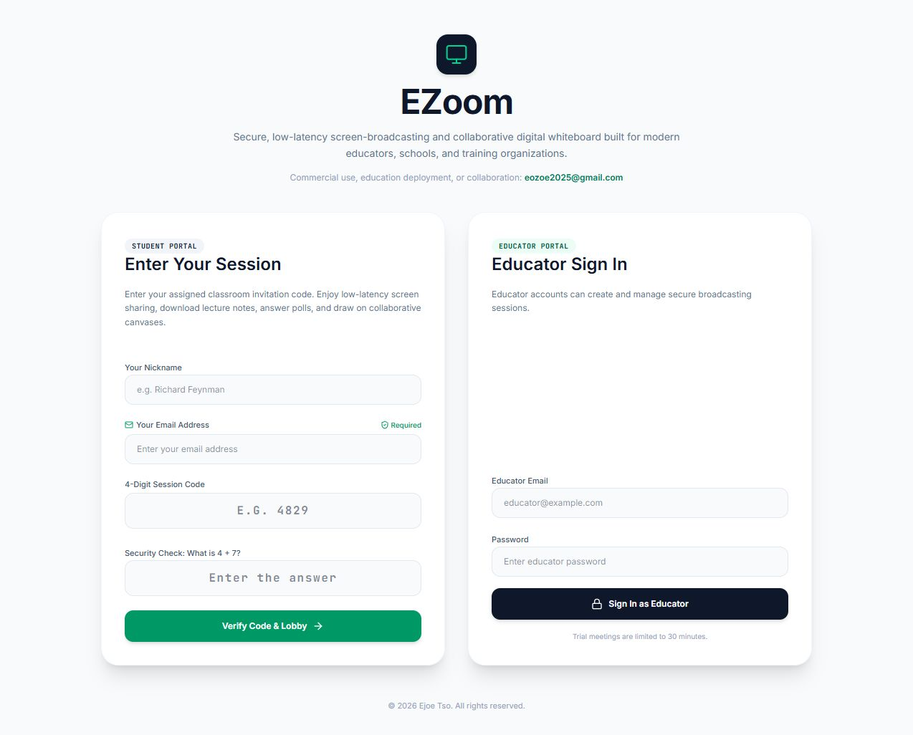
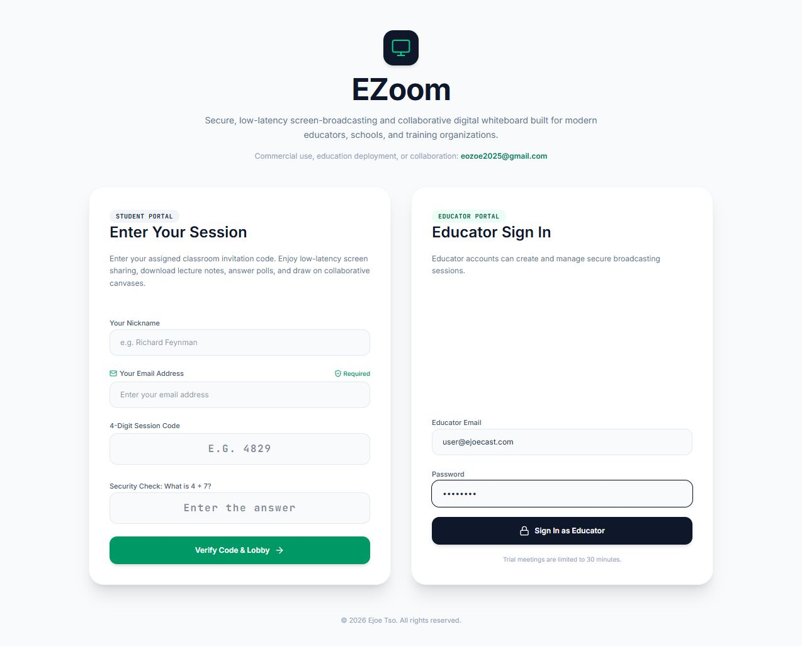
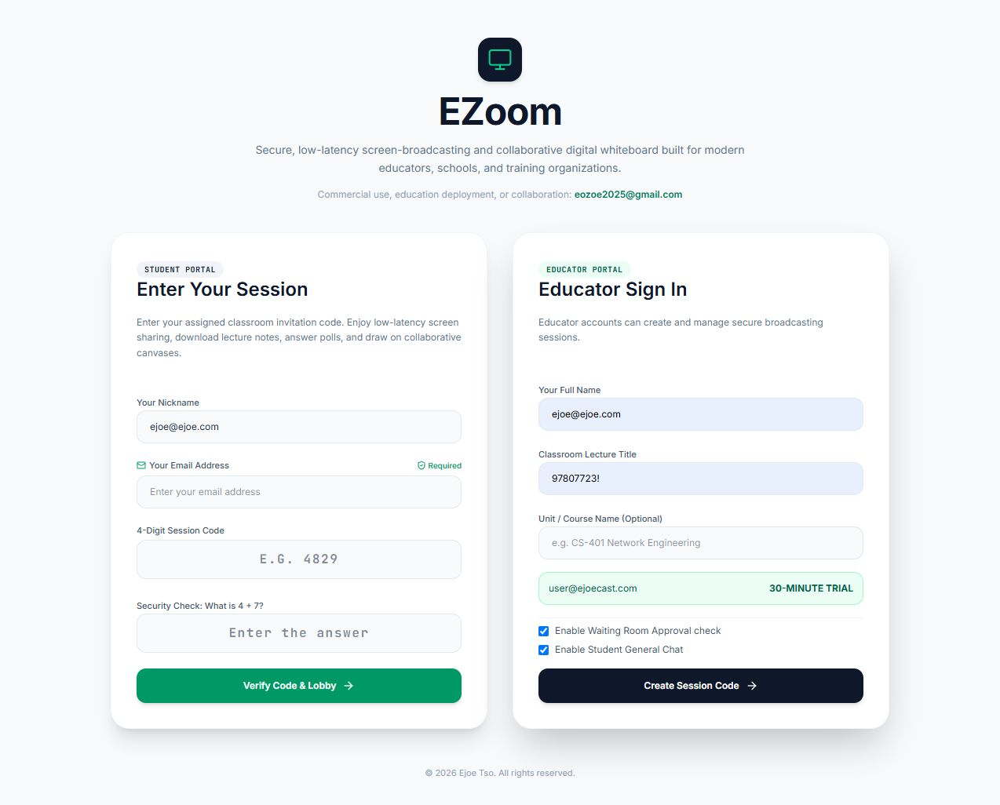
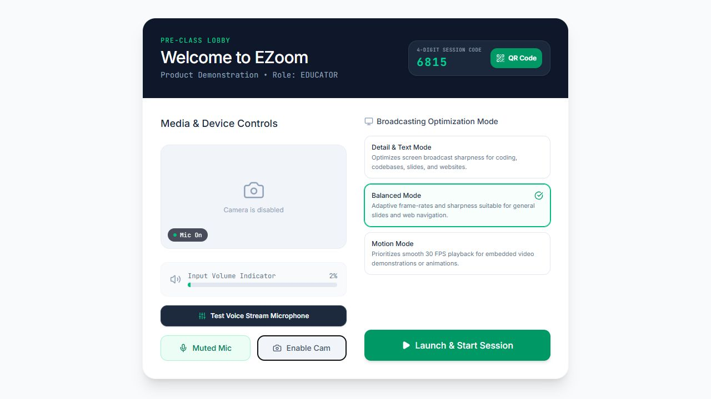
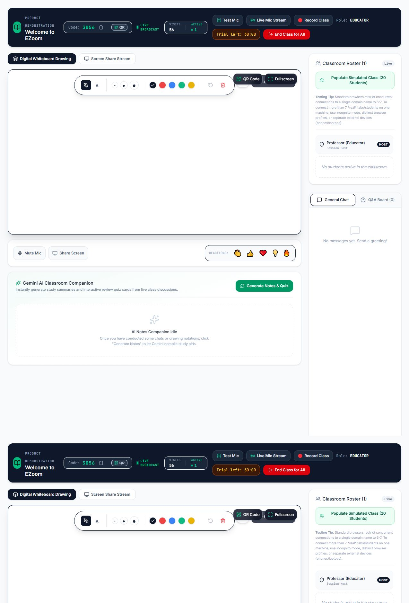
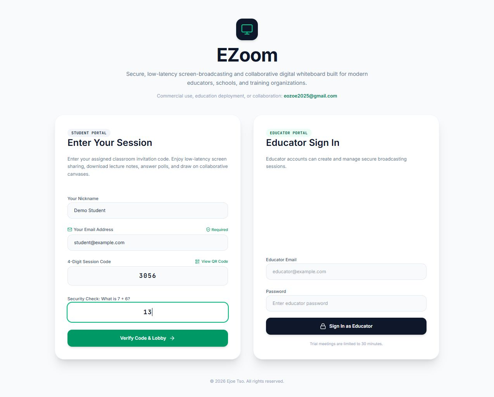
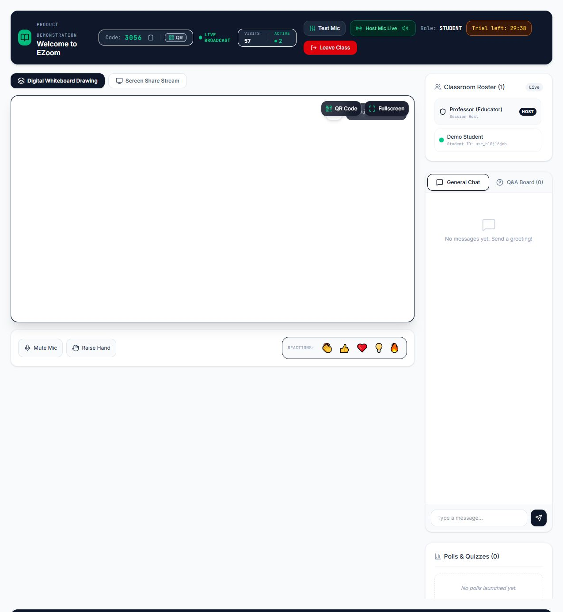

# EZoom visual user guide

This guide walks through a complete EZoom trial meeting. The accompanying [demo video](EZoom-demo.mp4) presents the same workflow as a short visual tour.

## 1. Open EZoom

The landing page separates student entry from educator authentication. Commercial, education, and collaboration enquiries can be sent to **eozoe2025@gmail.com**.

## 2. Sign in as a trial educator

Use the public trial account:

- Email: `user@ejoecast.com`
- Password: `user123!`
- Meeting allowance: 30 minutes

## 3. Create a session

Enter an educator display name, meeting title, and optional course name. Choose whether students require waiting-room approval and whether general chat is enabled, then select **Create Session Code**.

## 4. Check devices in the lobby

Confirm that the microphone meter responds and the camera preview is visible. Choose the broadcast quality mode, then select **Launch & Start Session**. Share the four-digit code or QR link with students.

## 5. Teach in the live classroom

The header shows the meeting timer, participant activity, microphone stream, recording, and exit controls. The main workspace provides whiteboard, screen sharing, annotations, chat, Q&A, polls, resources, and AI learning tools. The educator camera can be turned off from its camera panel.

## 6. Join as a student

Students enter their name, email address, four-digit session code, and the answer to the displayed math security question. Scanning the QR code fills the room code automatically.

## 7. Participate in class

After joining or receiving waiting-room approval, students can see the educator camera and shared teaching content, listen to the live educator voice, use chat and Q&A, answer polls, and collaborate on the whiteboard. Browsers may require one click on **Tap to Enable Live Host Voice** before audio playback begins.

## Support

For commercial use, education licensing, custom deployment, or collaboration, email **eozoe2025@gmail.com**.

Copyright © 2026 Ejoe Tso. All rights reserved.
